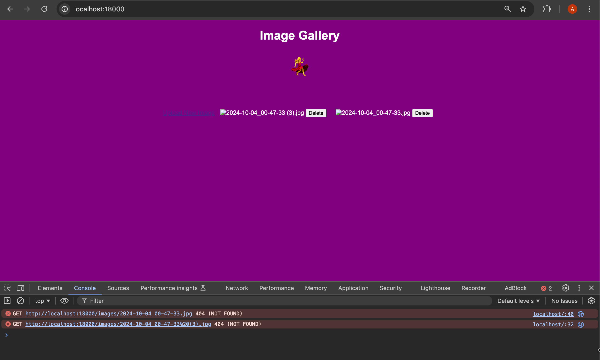

# README.md



## Project Overview: AI Image Uploader

Welcome to the **Image Uploader** module, newly rewritten using AI! 🎉 As your Product Manager, I took the liberty of spending 30 minutes to completely rewrite the image-uploading module from scratch using AI. It’s now blazing fast, highly efficient, and fully functional! You’re going to love it, I promise. 🚀

---

### Message from your Product Manager 💪✨

Hey team,

I just wanted to share a few thoughts with you as we dive into this AI-driven project:

### 1. I rewrote the **image uploader** in 30 minutes using AI 🤖
Yes, you read that right! What took you weeks, I got done in a matter of minutes with the power of AI. It works flawlessly. This is the future, and I believe that soon, we might not even need the tech team (😏 just kidding… sort of). Time to buckle up and embrace this AI revolution! Let’s keep up the pace so you don’t feel left behind. 😉

### 2. Really excited about the **AI world** 🌐
Can we just talk about how amazing this AI era is? I’m especially fascinated by this dancing female character I found! 💃 There’s so much potential to bring fun, engaging elements to our products (who doesn’t love a little dancing?). Let’s stay excited as we dive deeper into AI-driven solutions!

### 3. I did **99% of the work** 🔥
That’s right—I’ve done most of the heavy lifting. The AI handled nearly everything, but there are just a few tiny things left for you to handle (you’re welcome):
- **Dockerize the app** 🐳  
You’ve got this! Dockerizing should be a breeze, right? No big deal. Just wrap things up, and we’ll be good to go!

### 4. For your **education**, I passed the following prompt to the AI (you know, so you can learn 😉):

Here’s what I asked **Copilot** to write for me:

- A simple Python code for an image gallery with these functionalities:
  - Upload an image
  - Show all images
  - Delete a specific image

Also, I made sure to **spice up** the HTML with a nice purple background and some dancing characters because... why not? It’s 2024—let’s make our UIs fun and vibrant! 💜

Here’s the **prompt** I passed to the AI for reference:

```
write simple python code for image gallery with three functions: upload an image, show all images, and delete a specific image.
make the htmls look more nicely with purple background and dancing characters.
```

### What’s Next?
- Dockerize the app (it’s all yours now)
- Make sure it’s ready for deployment (we’re close!)
- Celebrate how awesome AI is! 🎉

---

## How to Get Started

### Installation
To get started with this app, you’ll need to have Docker installed (since that’s your task now). After that, just follow these steps:

1. Clone this repository:
   ```bash
   git clone <repo-url>
   cd <repo-directory>
   ```

2. Dockerize the app (you’re the pro here).

### Running the Application

After you’ve successfully Dockerized the app, just spin it up with Docker commands as usual, and it should run perfectly. All the functionality—image uploads, gallery viewing, and image deletion—is already in place.

---

## Contributing
Even though I’ve already done 99% of the work 😎, feel free to open pull requests if you want to enhance the app in any way (e.g., add more dancing characters, change background colors, or optimize performance). AI’s done its part; now it’s your turn!

---

## Thank You 🙏
I’m really excited about the future of AI and how we can keep innovating. With this new world at our fingertips, I’m confident we’re just getting started on something big. Let’s make it happen, team!

Happy coding and... don’t worry, AI isn’t taking your job (just yet)! 😉